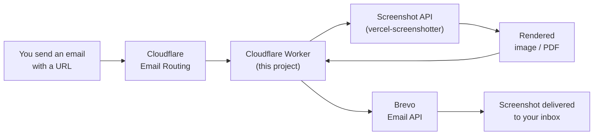

<div align="center">


# Screenshot via Email

**Send an email. Get a screenshot back.**

No apps, no sign-ups, no dashboards. Just email a URL and receive a picture of
that page in your inbox a few seconds later.

[](./LICENSE)
[](https://workers.cloudflare.com/)
[](https://www.brevo.com/)
[](#)
[](#contributing)

[How it works](#how-it-works) •
[Quick start](#quick-start) •
[Commands](#email-command-cheatsheet) •
[Examples](#real-world-examples) •
[FAQ](#faq)

</div>

---

> [!WARNING]
> **AGPL notice**
> If you run this software as a network service (including SaaS or any hosted
> product), you must make the complete corresponding source code available to
> your users under the terms of the GNU AGPL v3.0. See [`LICENSE`](./LICENSE).

---

## What is this?

This is a tiny serverless service that turns **email into screenshots**.

You send a message to a special email address with a link in it. The service
opens that link in a real browser, takes a picture, and emails the image back
to you. You can also control *how* the picture is taken (mobile layout, full
page, PDF, and much more) using simple keywords.

It runs entirely on **Cloudflare Workers** (no servers to manage) and uses the
open-source [vercel-screenshotter](https://gitlab.com/samweiss/vercel-screenshotter)
engine for the actual rendering.

---

## Table of contents

- [What is this?](#what-is-this)
- [How it works](#how-it-works)
- [Features](#features)
- [Quick start](#quick-start)
- [Configuration](#configuration)
- [Email command cheatsheet](#email-command-cheatsheet)
- [Real-world examples](#real-world-examples)
- [Using your own screenshot API](#using-your-own-screenshot-api)
- [Tech stack](#tech-stack)
- [FAQ](#faq)
- [Security](#security)
- [Contributing](#contributing)
- [License](#license)

---

## How it works



In plain English:

1. **You** email a URL to your configured address.
2. **Cloudflare Email Routing** catches the message and hands it to the Worker.
3. **The Worker** reads your subject/body, figures out your options, and asks the
   screenshot API to render the page.
4. **Brevo** mails the resulting image (or PDF) back to the sender.

---

## Features

- **Email-only interface** — works from any mail client, on any device.
- **Rich capture control** — viewport, full page, chunks, element, region, and multi-device modes.
- **Multiple formats** — PNG, JPEG, WebP, and PDF.
- **Fine-grained options** — custom viewport size, CSS injection, auto-scroll, wait timers, quality, and element hiding.
- **Full [vercel-screenshotter](https://vercel-screenshotter-samweiss.vercel.app) power** exposed through plain-English keywords.
- **Serverless & cheap** — runs on Cloudflare Workers with an optional free tier.
- **Safe by default** — private/local addresses are rejected, and request size is capped.
- **Open source** under the AGPL v3.0.

---

## Quick start

> New to Cloudflare? Follow these steps in order. It takes about 10 minutes.

### 1. Prerequisites

- A domain managed by **Cloudflare** (so you can use Email Routing).
- A free **[Brevo](https://www.brevo.com/)** account to send the reply emails.
- The **[Wrangler](https://developers.cloudflare.com/workers/wrangler/)** CLI
  (`npm install -g wrangler`).

### 2. Clone and install

```bash
git clone https://github.com/a353121/screenshots-via-email.git
cd screenshots-via-email
npm install
```

### 3. Log in to Cloudflare

```bash
wrangler login
```

### 4. Add your secrets

Set your Brevo credentials (see [Configuration](#configuration)):

```bash
wrangler secret put BREVO_API_KEY
wrangler secret put BREVO_FROM_EMAIL
```

### 5. Deploy

```bash
wrangler deploy
```

### 6. Route your email address

In the Cloudflare dashboard go to **Email → Email Routing** and create a custom
address (for example `shot@yourdomain.com`) that forwards to this Worker.

### 7. Try it

Send an email to that address with a link in the body:

```
To:      shot@yourdomain.com
Subject: screenshot
Body:    https://example.com
```

Wait a few seconds and check your inbox for the screenshot.

> [!TIP]
> Start simple. Just email a URL first, then experiment with the
> [command cheatsheet](#email-command-cheatsheet).

---

## Configuration

Set these values in `wrangler.toml` (non-sensitive) or via
`wrangler secret put` (sensitive). You can also manage them in the Cloudflare
dashboard under **Workers → your-worker → Settings → Variables**.

| Variable | Required | Description |
| --- | :---: | --- |
| `BREVO_API_KEY` | Yes | Your Brevo API key. **Keep secret.** |
| `BREVO_FROM_EMAIL` | Yes | The verified sender address Brevo sends from. |
| `SCREENSHOT_API_BASE` | Yes | Base URL of the screenshot API. Defaults to the public vercel-screenshotter instance. |
| `SCREENSHOT_API_TOKEN` | No | Bearer token, if your screenshot API requires authentication. |

**Example `wrangler.toml`:**

```toml
[vars]
BREVO_FROM_EMAIL = "screenshots@yourdomain.com"
SCREENSHOT_API_BASE = "https://vercel-screenshotter-samweiss.vercel.app"
SCREENSHOT_API_TOKEN = ""
```

> [!IMPORTANT]
> Never commit real API keys. Store `BREVO_API_KEY` with `wrangler secret put`,
> not in `wrangler.toml`.

---

## Email command cheatsheet

Put any of these keywords in the **subject** or the **body**. Order doesn't
matter, capitalisation doesn't matter, and you can combine as many as you like.
Separators like `:` or `=` are optional (`format: pdf`, `format=pdf`, and
`format pdf` all work).

| Goal | What to write | Also accepted |
| --- | --- | --- |
| Device | `mobile`, `desktop`, `tablet`, `iphone`, `ipad`, `laptop`, `pixel` | `macbook`, `android`, `phone`, `computer` |
| Full page | `full page` | `fullpage`, `full-page`, `entire page`, `whole page` |
| Visible area only | `viewport` | `visible`, `above the fold` |
| Long page in pieces | `chunks` | `chunk`, `chunked`, `slices` |
| One element | `element .hero` | `selector .hero`, `component #main` |
| A rectangle | `region 0,0,800,600` | `crop 0,0,800,600`, `area …` |
| Many devices at once | `multi-device` | `multi device`, `devices`, `all devices` |
| Format | `pdf` | `png`, `jpg`, `jpeg`, `webp` (or `format pdf`) |
| Size | `1920x1080` | `size 1920x1080`, `width 1920`, `height 1080` |
| Wait | `wait 5s` | `wait 5000` (ms), `delay 3s`, `sleep 2s` |
| Quality | `quality 90` | `quality=80`, `quality: 70` |
| Inspect | `inspect` | `inspect only`, `inspect all` |
| Load lazy content | `auto scroll` | `autoscroll`, `scroll`, `lazy`, `lazy load` |
| Hide elements | `hide .cookie-banner` | `hide .a, .b` (comma-separated) |
| Remove elements | `remove #ads` | `remove .popup, .banner` |
| Stitch chunks into one image | `chunks stitched` | `chunk output stitched`, `single image` |
| Chunk tuning | `chunk overlap 50` | `chunk preset a4`, `chunk format png` |
| Zip the output | `zip` | `download` |
| Allow page scripts | `allow scripts` | `no scripts` to disable |
| Inject custom CSS | a line starting with `css:` | see below |

> [!TIP]
> Forgot the commands? Just email the address with **no link**. The service
> replies with this cheatsheet automatically.

**CSS injection example** (put this in the body):

```text
https://example.com

css:
body { background: white !important; }
header { display: none !important; }
```

Anything after the `css:` line is treated as styles, so it never clashes with
your commands.

---

## Real-world examples

Every example below is copy-paste ready. Only the subject and body matter.

### The basics

**1. Simplest possible request** — a full-page desktop JPEG is sent by default.

```text
Subject: screenshot
Body:    https://example.com
```

**2. Visible area only** (just what fits on screen):

```text
Subject: viewport
Body:    https://example.com
```

**3. Mobile layout:**

```text
Subject: mobile full page
Body:    https://example.com
```

**4. Tablet on one page, full page:**

```text
Subject: tablet full page
Body:    https://example.com
```

### Choosing a format

**5. PDF** (great for printing or archiving):

```text
Subject: pdf
Body:    https://example.com
```

**6. High-quality JPEG at 1920x1080:**

```text
Subject: jpg quality 90 size 1920x1080
Body:    https://example.com
```

**7. WebP** (smaller files):

```text
Subject: webp
Body:    https://example.com
```

### Long pages

> [!NOTE]
> The word **`chunks`** only says *"this page is tall — cut it into segments."*
> It does **not** say how you want those segments delivered. Add one of these:
>
> - **`chunks`** / `chunk output separate` → one image **per segment** (several attachments).
> - **`chunks stitched`** / `chunk output stitched` → all segments joined into **one tall image**.
>
> `full page` is different again: it captures the whole page as a **single
> image in one shot** (no cutting, nothing to stitch).

**8. Split a long page into multiple images** (separate attachments):

```text
Subject: chunks
Body:    https://news.ycombinator.com
```

**9. Stitch those chunks into one tall image:**

```text
Subject: chunks stitched
Body:    https://en.wikipedia.org/wiki/Cloudflare
```

**10. Same thing, but explicitly separate attachments:**

```text
Subject: chunks separate
Body:    https://news.ycombinator.com
```

**11. Chunks with overlap and a preset:**

```text
Subject: chunks chunk preset a4 chunk overlap 50
Body:    https://example.com/long-report
```

**12. Zip everything into one attachment:**

```text
Subject: multi-device zip
Body:    https://example.com
```

### Capturing part of a page

**13. One element:**

```text
Subject: element .hero
Body:    https://example.com
```

**14. Several elements:**

```text
Subject: selector #pricing
Body:    https://example.com
```

**15. A rectangle (x,y,width,height):**

```text
Subject: region 0,0,1024,768
Body:    https://example.com
```

### Cleaning up the page

**16. Hide cookie banners and ads:**

```text
Subject: full page
Body:    https://example.com
         hide .cookie-banner, #ads, .popup
```

**17. Wait for animations, then scroll through lazy content:**

```text
Subject: wait 5s auto scroll
Body:    https://example.com
```

**18. Inject custom CSS:**

```text
Subject: full page png
Body:    https://example.com

         css:
         body { background: #ffffff !important; }
         .sticky-nav { display: none !important; }
         h1 { color: #111 !important; }
```

### Comparing and inspecting

**19. Same page on many devices:**

```text
Subject: multi-device
Body:    https://example.com
```

**20. Debug which elements exist:**

```text
Subject: inspect
Body:    https://example.com
```

**21. Kitchen sink** — combine as much as you want:

```text
Subject: mobile jpg quality 80 wait 3s auto scroll hide .banner
Body:    https://example.com
```

### Quick reference index

<details>
<summary><strong>Click to expand a full one-page cheat sheet</strong></summary>

```text
DEVICE   mobile | desktop | tablet | iphone | ipad | laptop | pixel
MODE     full page | viewport | element | region | multi-device
CHUNKS   chunks            -> separate images (one per segment)
         chunks stitched   -> all segments joined into one image
FORMAT   png | jpg | jpeg | webp | pdf | zip
SIZE     1920x1080 | size 1280x720 | width 1440 | height 900
TIMING   wait 5s | wait 5000 | auto scroll | lazy
POLISH   quality 90 | hide .x, .y | remove #ads | inspect
CHUNK    chunk preset a4 | chunk overlap 50 | chunk output separate
CSS      a line starting with css:  (everything after it is styles)
```
</details>

---

## Using your own screenshot API

By default this project points at the public
[vercel-screenshotter](https://vercel-screenshotter-samweiss.vercel.app)
instance. For production use, deploy your own so you're not depending on someone
else's rate limits:

1. Fork / deploy
   [samweiss/vercel-screenshotter](https://gitlab.com/samweiss/vercel-screenshotter).
2. Copy the deployed base URL.
3. Set `SCREENSHOT_API_BASE` to that URL.
4. If it requires auth, set `SCREENSHOT_API_TOKEN`.

---

## Tech stack

| Layer | Technology |
| --- | --- |
| Runtime | [Cloudflare Workers](https://workers.cloudflare.com/) |
| Inbound email | [Cloudflare Email Routing](https://developers.cloudflare.com/email-routing/) |
| Outbound email | [Brevo Email API](https://www.brevo.com/) |
| Email parsing | [postal-mime](https://www.npmjs.com/package/postal-mime) |
| Screenshot engine | [vercel-screenshotter](https://gitlab.com/samweiss/vercel-screenshotter) |

---

## FAQ

<details>
<summary><strong>I emailed a link but got nothing back.</strong></summary>

- Make sure the URL starts with `http://` or `https://` (or `www.`).
- Check that the domain isn't private/local (those are blocked).
- Look in your spam folder — Brevo replies can be filtered.
- Verify `BREVO_API_KEY` and `BREVO_FROM_EMAIL` are set correctly.
</details>

<details>
<summary><strong>Can I put the URL in the subject line?</strong></summary>

Yes. The service looks for a URL in the subject **and** the body, so either works.
</details>

<details>
<summary><strong>Why is my screenshot blank or cut off?</strong></summary>

The page may load content slowly. Add `wait 5000` (5 seconds) or `auto scroll`
to let lazy content load before capture.
</details>

<details>
<summary><strong>The attachment is too big.</strong></summary>

There are size limits on email attachments. Try `mobile`, a smaller
`WIDTHxHEIGHT`, or a lower `quality` to shrink the file.
</details>

<details>
<summary><strong>Can it screenshot sites that need a login?</strong></summary>

Not out of the box. The service only sees public pages reachable without
authentication.
</details>

---

## Security

- Private and loopback hosts (`localhost`, `10.x`, `127.x`, `192.168.x`,
  `172.16-31.x`) are rejected.
- Incoming email size is capped (10 MB).
- Attachments larger than the email limit are not sent; you get a notice instead.

To report a vulnerability, email **security@rendermail.us.kg**. Please do **not**
open a public issue for security problems.

---

## Contributing

Contributions, issues, and feature requests are welcome.

By contributing, you agree that your contributions are licensed under the
**GNU Affero General Public License v3.0**.

1. Fork the repo.
2. Create a branch: `git checkout -b feature/my-feature`.
3. Commit your changes and open a pull request.

---

## License

Licensed under the **GNU Affero General Public License v3.0 (AGPL-3.0)**.

You are free to use, modify, and distribute this software under the terms of the
AGPL-3.0. If you run a modified version as a network service, you must make the
source code available to your users. See [`LICENSE`](./LICENSE) for details.

---

<div align="center">

**Live project:** [www.RenderMail.us.kg](https://www.rendermail.us.kg)

<a href="https://www.rendermail.us.kg">
  
</a>

<sub>Made with Cloudflare Workers, Brevo, and open source.</sub>

</div>
